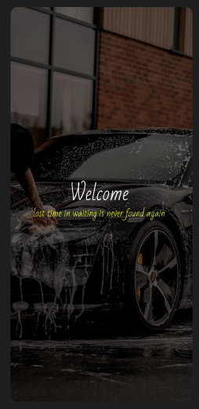
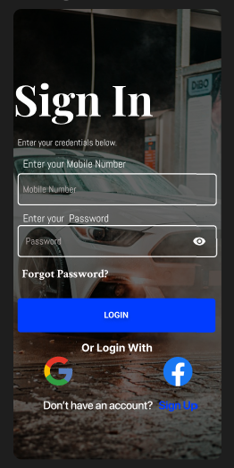
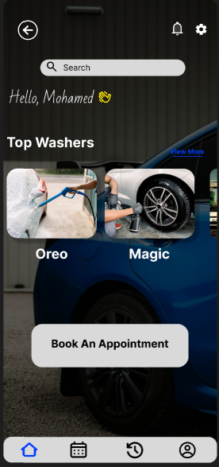
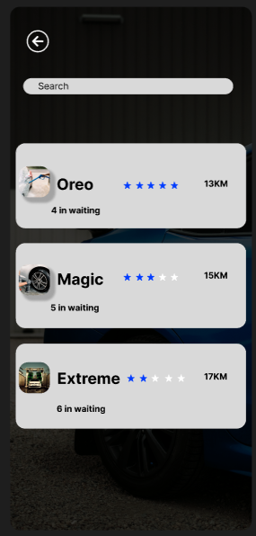
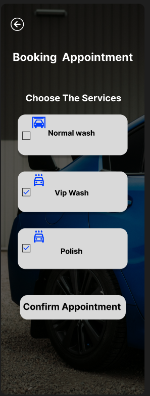
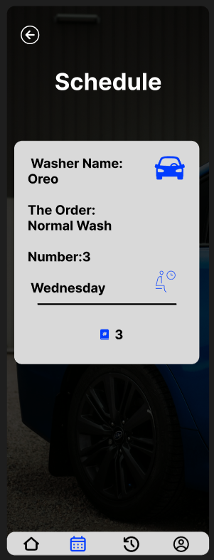
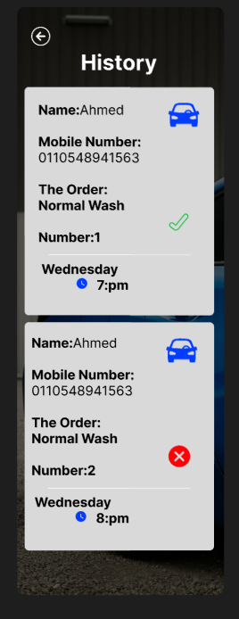
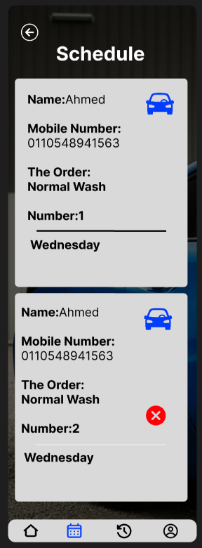
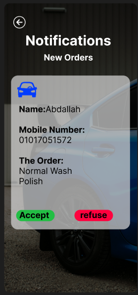

# 🚗 Car Wash Booking App

A Flutter mobile application for booking car wash services — featuring a **User App** and an **Admin App**, both connected to Firebase in real-time.

---

---

## 📸 Screenshots

### 🚪 Onboarding

| Splash | Select Role | Login |
|:---:|:---:|:---:|
|  |  |  |
| **Splash Screen** | **Admin or User?** | **Login** |

---

### 👤 User App

| Home | Search | Book Appointment |
|:---:|:---:|:---:|
|  |  |  |
| **Home** | **Search Car Wash** | **Book Appointment** |

| Confirm | Schedule | Notifications |
|:---:|:---:|:---:|
|  |  |  |
| **Confirm Booking** | **My Schedule** | **Notifications** |

---

### 🛠️ Admin App

| Home | Choose Service | Booking History |
|:---:|:---:|:---:|
|  |  |  |
| **Admin Home** | **Manage Services** | **Booking History** |

| Schedule | Notifications |
|:---:|:---:|
|  |  |
| **Schedule Management** | **Notifications** |

---

## ✨ Features

### 👤 User App
- 🔍 Search for nearby car wash locations
- 📍 View car wash location on Google Maps
- 📏 See distance between user and car wash
- 📅 Book a car wash appointment
- 🗓️ View personal booking schedule
- 🔔 Receive real-time notifications on booking updates

### 🛠️ Admin App
- ➕ Add services offered at the car wash
- 📍 Set car wash location via Google Maps
- 📋 View and manage all bookings
- 🗓️ Priority-based scheduling based on number of bookings
- 🔔 Receive notifications on new booking requests

---

## 🛠️ Tech Stack

| Layer | Technology |
|:---|:---|
| 📱 Mobile | Flutter, Dart |
| 🔥 Backend | Firebase Firestore |
| 🔔 Notifications | Firebase Cloud Messaging (FCM) |
| 🗺️ Maps | Google Maps API |

---

## 📌 Project Status

> ✅ **Completed** &nbsp;&nbsp;|&nbsp;&nbsp; 🔒 **Source Code: Private**

---

*Made with 🚗 by Youssef Hesham*

